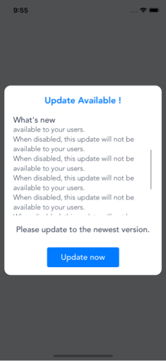
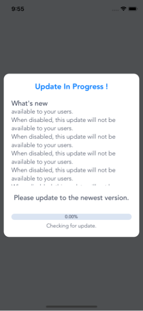
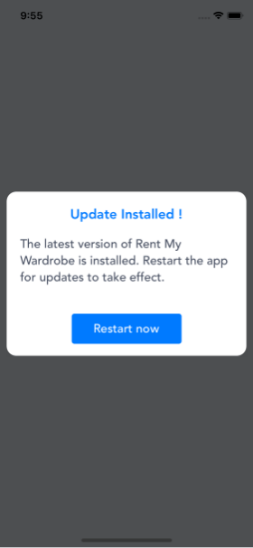
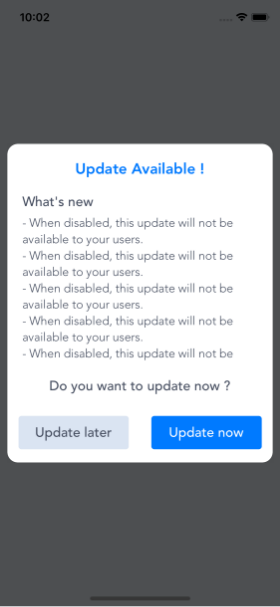
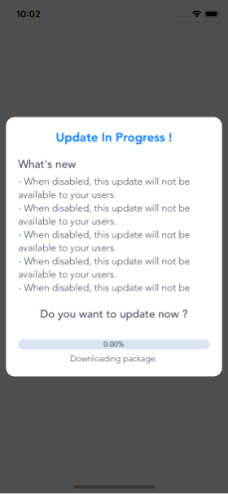

# rn-codepush-dialog

Simple dialog prompt for code push update:

- Support 2 modes: mandatory and not mandatory.
- Easy to customize style.
- Easy to change texts.
- Simple to use ( please view in example project ).

